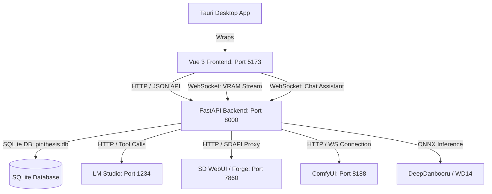

# Repository Guidelines

## Project Overview
Pinthesis (also referred to as Slop Central) is a local AI-assisted media cataloging, tagging, rating, recommendation, and content generation suite. It provides a desktop interface to view image libraries, rate images using Elo-style TrueSkill matchups, fetch similarity-based recommendations (using TF-IDF and pHash), generate new media (via ComfyUI, Stable Diffusion WebUI/Forge, and AI Horde), tag images using local ONNX interrogators (DeepDanbooru/WD14), compile panel-by-panel comics or slideshow-style stories, and chat with a local LLM assistant (Airi) that leverages a progressive markdown-based skills pipeline and an in-memory vector-based RAG store.

---

## Architecture & Data Flow
The project is built as a three-tier system:
1. **Tauri v2 Desktop Shell** (`vue-project/src-tauri/`): A Rust-based container that wraps the Vue frontend, handles desktop window boundaries, manages security permissions via capabilities, and configures system logging.
2. **Vue 3 SPA Frontend** (`vue-project/src/`): Built with Vue 3 (Composition API), Vite, and Tailwind CSS v4. It manages reactive UI state, renders masonry grid layouts, and formats generation requests via adapter layers. It communicates directly with the Python API.
3. **FastAPI Python Backend** (`img-api/`): A local Python server running on Uvicorn. It handles database CRUD operations, local vector search indexing (RAG), TrueSkill matchup calculations, recommendations, AI agent tool execution, Stable Diffusion process proxying, and local ONNX image tagging.

### Data Flow


---

## Key Directories
* **`img-api/`**: Main Python backend directory.
  * **`routes/`**: Contains endpoint routers for features (e.g. `images.py`, `assistant.py`, `rag.py`, `rec.py`, `rate.py`, `tagger.py`).
  * **`skills/`**: Markdown guides explaining workflows to the chatbot agent, loaded via progressive keyword matching.
  * **`storage/`**: App configuration files (e.g. `ai_settings.json`).
  * **`files/`**: Local storage containing cataloged assets, served statically by FastAPI.
* **`vue-project/`**: Core frontend workspace.
  * **`src/`**: Vue 3 source files.
    * **`components/`**: Layout, chat panels, masonry view, and sidebar generation controls.
    * **`views/`**: Page views mapped by the router.
    * **`backends/`**: Mappings and schema structures representing generation engine targets.
    * **`router/`**: Single-page navigation mappings.
    * **`assets/`**: Base stylesheets containing Tailwind v4 theme variables.
  * **`src-tauri/`**: Native desktop configuration, permissions, and Rust wrappers.

---

## Development Commands
### Backend Development
The Python backend expects a Conda environment. Start the server using the batch script or standard uvicorn:
```bash
# Via batch script
cd img-api && start.bat

# Manual startup
cd img-api
uvicorn main:app --host 0.0.0.0 --reload --reload-exclude ./files/
```

### Frontend Development
Install dependencies and run the Vite hot-reloading dev server:
```bash
cd vue-project
pnpm install
pnpm dev
```

### Tauri Desktop Wrapper
Run the desktop container pointing to the development frontend:
```bash
cd vue-project
pnpm tauri dev
```

### Build Commands
Compile and bundle production assets:
```bash
# Build Vue SPA (outputs to vue-project/dist/)
cd vue-project
pnpm build

# Compile Tauri native application executable
cd vue-project
pnpm tauri build
```

---

## Code Conventions & Common Patterns
### Naming & Style Conventions
* **Frontend Components**: PascalCase names (e.g., `Image.vue`, `ImageMasonry.vue`).
* **Frontend Views**: PascalCase or camelCase (e.g., `HomeView.vue`, `canvasView.vue`).
* **Backend Modules**: snake_case files and folder names (e.g., `lmstudio_client.py`).
* **Styling**: Configured with Tailwind CSS v4. Theme custom variables are placed directly in `vue-project/src/assets/base.css` inside the `@theme` block.

### Error Handling Pattern
* **Python Backend**: Standardizes on raising `fastapi.HTTPException` for route-level failures. All filesystem actions, JSON manipulations, and external API requests must be wrapped in `try-except` blocks to prevent ASGI server crashes.
```python
try:
    with open(path, "r", encoding="utf-8") as f:
        return json.load(f)
except Exception as e:
    raise HTTPException(status_code=500, detail=f"Failed to read database: {str(e)}")
```
* **Frontend SPA**: Wraps fetch routines inside try-catch, outputting developer errors to console logs and updating reactive status messages for users.

### Async vs Sync Programming
* **Sync (Python)**: Synchronous functions are used for heavy CPU computations, filesystem I/O, scikit-learn TF-IDF runs, and TrueSkill ratings. FastAPI executes sync route functions (`def`) automatically within a thread pool to avoid blocking the loop.
* **Async (Python)**: Asynchronous loops (`async def`) are reserved for WebSockets (GPU VRAM stats, chat assistant socket stream) and HLS video streaming proxy endpoints.
* **Frontend (JS)**: Uses async/await syntax for all HTTP network transactions (`GetFromApi`, `PostToApi`) and event-driven WebSocket handlers (`UpdateVRAM`).

### Dependency Injection
* The Vue application uses the `provide`/`inject` pattern to share global states down the component tree (e.g., `isDarkMode` state provided in `App.vue` and consumed by page views).

### State Management
* **Frontend SPA (No Pinia)**: Global state is handled via shared reactive objects defined in `vue-project/src/api.js`:
  * `webState`: Tracks active generator backend engine, sidebar layout variables, and WebSocket VRAM telemetry.
  * `request`: Serves as the central repository for image generation parameters (prompts, size, steps).
  * `current_model`: Stores details of active checkpoints and LoRAs.
* **Backend Datastore (SQLite Database)**: Data is stored in a local SQLite database file `pinthesis.db` in `img-api/`. State synchronization and loading are managed in `img-api/utils.py`:
  - **JIT Lazy Loading**: Image and board configurations are loaded asynchronously into memory on startup via a daemon thread.
  - **Load Middleware**: A FastAPI middleware (`_ensure_data_loaded`) intercepts incoming endpoints (excluding static, doc, or proxy targets) and blocks execution via `asyncio.to_thread` until memory load completes.
  - **Sanitization**: Before committing metadata changes back to the `images` table, explicit save functions sanitize runtime-only properties (e.g., stripping `tags_set`, `pHash`, `Likes`, `Dislikes`, `Rating` from the serializable metadata JSON structure).

---

## Important Files
* **`img-api/main.py`**: Server entry point. Controls route registration, StaticFiles mounting, startup data load triggers, and video proxy HLS stream rewrites.
* **`img-api/utils.py`**: State broker. Manages database loads, writes, serialization sanitizing, and hashing operations (pHash Hamming distance).
* **`img-api/routes/lmstudio_client.py`**: Local model adapter. Maps Python functions to OpenAI tool schema definitions and processes streaming responses.
* **`img-api/routes/assistant.py`**: Assistant coordinator. Runs the WebSocket connection loop for chat interface Airi, utilizing RAG context, skills parsing, and tool execution.
* **`img-api/routes/rag.py`**: Vector search index. Performs cosine dot-product comparisons using `nomic-embed-text` embeddings, falling back to a token keyword search.
* **`img-api/routes/skills.py`**: Progressive disclosure controller. Scans `img-api/skills/` markdown files, checking query keywords against YAML headers to inject relevant instructions into LLM system prompts.
* **`vue-project/src/api.js`**: Frontend interface state definition, WebSocket loops, and API fetch wrappers.
* **`vue-project/src/backends/index.js` & `comfyui.js`**: Mappings translating reactive UI generation settings into payload structures for Forge, ComfyUI, and Horde.

---

## Runtime/Tooling Preferences
* **Environment Dependencies**:
  * Python 3 with dependencies in `img-api/requirements.txt`.
  * Node.js with `pnpm` version `9.15.4` specified as the package manager in `vue-project/package.json`.
* **Execution Ports**:
  * **FastAPI Backend**: `8000` (HTTP & WebSockets)
  * **Vue Dev Server**: `5173`
  * **LM Studio API**: `1234`
  * **SD WebUI / Forge API**: `7860`
  * **ComfyUI API**: `8188`
* **Vite Tooling**: Vite config includes a localstorage shim because `vite-plugin-vue-devtools` requires a browser-like global `localStorage` mock to avoid throwing errors during CLI builds.

---

## Testing & QA
* **Automated Testing**: There is no automated test suite configured in this repository (no Pytest, Vitest, or Jest setups exist).
* **Validation Scripts**:
  * **`img-api/scratch_test.py`**: Stand-alone script verifying Windows GPU performance counters (Powershell `Get-Counter` query coupled with `psutil` process mapping).
* **Manual Verification Protocol**: Developers must manually run the FastAPI backend and Vue frontend to smoke test feature additions, ensuring the API routers compile correctly and that serializing database mutations does not corrupt the flat JSON structures. Ensure all payload structures match active backend endpoints.